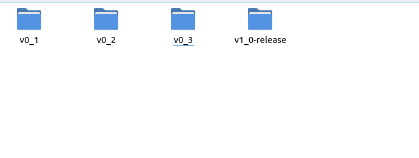
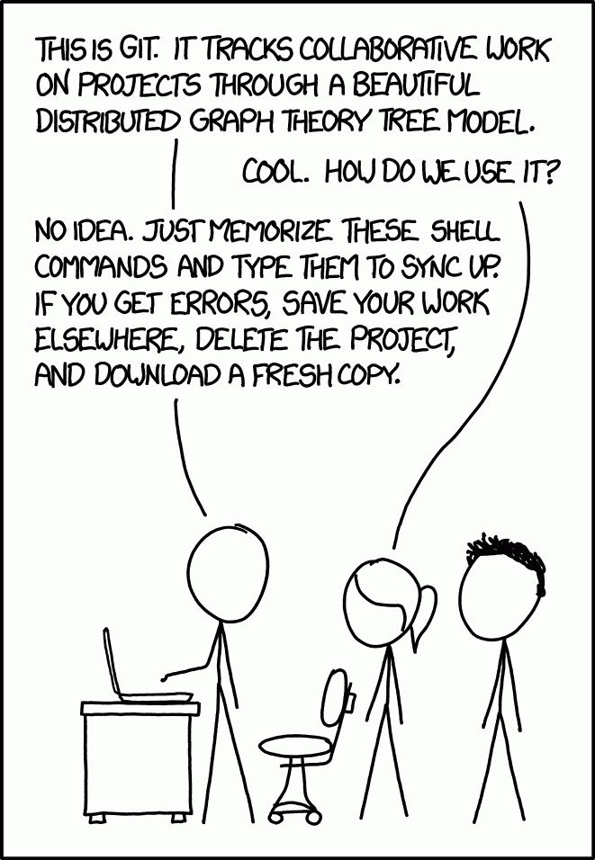
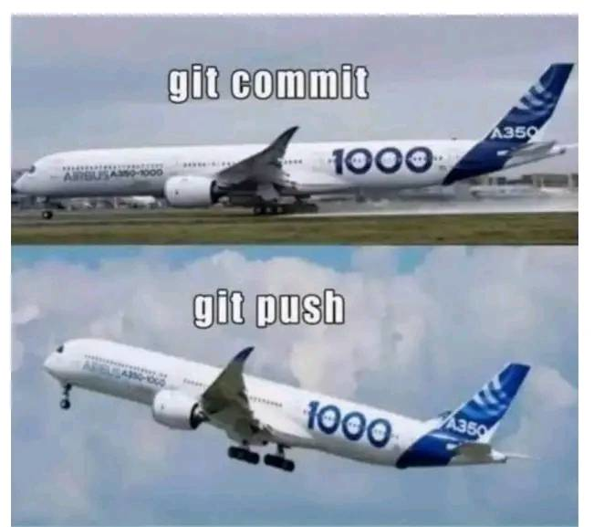

## A long long time ago...

---

## And then

### Version control

> Version control, also known as source control, is the practice of tracking
> and managing changes to software code. Version control systems are software
> tools that help software teams manage changes to source code over time.

Source: atlassian.com

---

## Version control: where it comes from?

- 1975: **Source Code Control System**, Bell Labs.
- 1982: Revision Control System (**RCS**), GNU, stores a set of **Deltas**.
- 1995: Helix Code, **Perforce**, flexibility of tools. Today, wraps around
  git.
- 2000: **Subversion** (SVN), Apache, allows concurrent access to a shared
  repository.
- 2005: **Git**, as a side project from the Linux devs, decentralised.

---

---

## Git

---

## Definitions

- A **repository** (or repo): a central storage location for managing and
  tracking changes in files and directories.
- A **remote**: a common repository that all team members use to exchange
  their changes.
- A **commit**: a snapshot or milestone along the timeline of a Git project.
- A **branch**: a pointer to a snapshot of your changes.

---

## More definitions

- **Checking out**: switching to a specific branch or commit.
- **Merging**: resolving the differences between two branches:
  1. Checkout the branch that you want to receive the changes,
  2. You merge the branch that contains the changes
  3. The merge will be another commit. We then push it so that others can
     access this newer version.

---

## Verbs

- **clone**: make a local copy from a remote repo.
- **pull**, **fetch**: get the latest changes from the remote.
- **push**: share the local changes with the remote.
- **stage**, **add**: make a list of files to be committed.
- **commit**: make a snapshot of the current project.
- **branch**: a labelled set of commits.
- **merge**: make a commit by combining two different branches.

---

## The order of the verbs matter

---

## The order of the verbs matter

---

##  Typical workflow

1. **Clone** the project from a remote. This gives us a local working copy of
   the project. You only need to do that if you don't already have a local
   copy of the project.
2. Start your work on it. I.e.: add some files or modify existing files.
3. **Stage** the files you want to include in your commit.
4. **Commit** with a useful message. Your changes will be local only.
5. **Pull** the changes others will have done from the remote.
6. **Push** your changes into the remote. You can choose which branch of the
   remote this new commit will go into.
7. Repeat from step 2.

## Why would you want to branch?

A branch is nothing more than a label over a set of commits. It evolves
independently from the rest of the development.

- Keep your working project clean. Don't add mess to a complex project.
- Experiment on the side, either on your own personal branch, or just with a
  subset of your team mates.
- Eventually merge your changes back to a shared branch.
- Keep track of your releases.

Branching is lightweight and fast.

> Branch early. Branch frequently.

---

## Git LFS

Git Large File Storage

---

## Don't ignore this

- Pushing large changes can use a lot of bandwidth.
- Temporary files are not necessary to keep the project in good working
  condition.

---

## Conclusion

