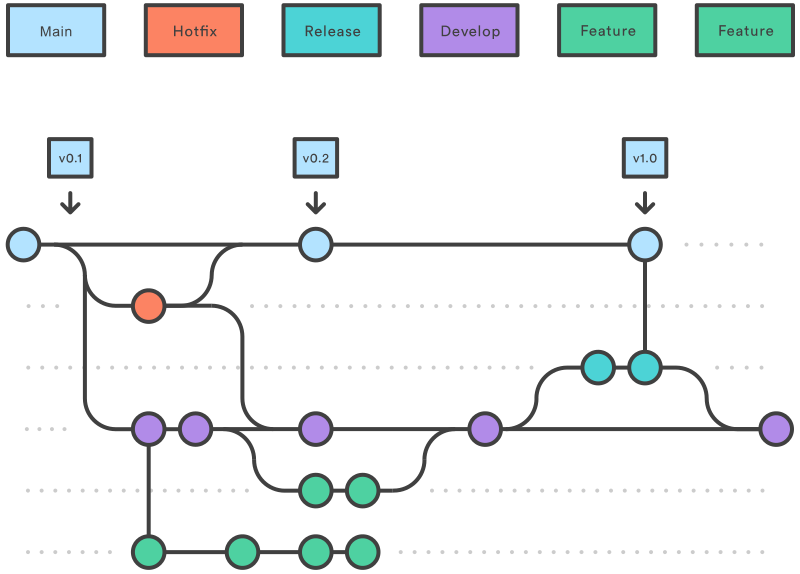

## A long long time ago...


---

## And then

### Version control

> Version control, also known as source control, is the practice of tracking
> and managing changes to software code. Version control systems are software
> tools that help software teams manage changes to source code over time.

Source: atlassian.com

---

## Version control: where it comes from?

- 1975: **Source Code Control System**, Bell Labs.
- 1982: Revision Control System (**RCS**), GNU, stores a set of **Deltas**.
- 1995: Helix Code, **Perforce**, flexibility of tools. Today, wraps around
  git.
- 2000: **Subversion** (SVN), Apache, allows concurrent access to a shared
  repository.
- 2005: **Git**, as a side project from the Linux devs, decentralised.

---

## Git


---


---

## Distinction

The difference between git and github:

- Git is:
  - The software that manages the versions of the code.
  - Open source.
- Github is:
  - A website, that offers a popular free **remote** hosting service.
  - Owned by Microsoft.

There are alternatives to Git. There are alternatives to Github.

---

## Definitions

- A **repository** (or repo): a central storage location for managing and
  tracking changes in files and directories.
- A **remote**: a common repository that all team members use to exchange
  their changes.
- A **commit**: a snapshot or milestone along the timeline of a Git project.
- A **branch**: a pointer to a snapshot of your changes (a commit).

---

## More definitions

- **Checking out**: switching to a specific branch or commit. Further commits will happen in this
  particular branch (independently from the rest of the development).
- **Merging**: resolving the differences between two branches:
  1. Checkout the branch that you want to receive the changes,
  2. You merge the branch that contains the changes.
  3. The merge will be another commit. We then push it so that others can
     access this newer version.


---

## Verbs

- **clone**: create a local copy from a remote repo.
- **pull**, **fetch**: get the latest changes from the remote.
- **push**: share the local changes with the remote.
- **stage**, **add**: make a list of files to be committed.
- **commit**: make a snapshot of the current project. Requires a comment.
  E.g.: "level 10, final version"

---

## The order of the verbs matter


---

## The order of the verbs matter


---

##  Typical workflow

1. **Clone** the project from a remote. This gives us a local working copy of
   the project. You only need to do that if you don't already have a local
   working copy of the project.
2. **Checkout** a branch and **pull** all the data from the remote or create a
   new one.
3. Start your work on it. I.e.: add some files or modify existing files.
4. **Stage** the files you want to include in your commit.
5. **Commit** with a useful message. Your changes will be local only.
6. **Pull** the changes others will have done from the remote.
7. **Push** your changes into the remote. You can choose which branch of the
   remote this new commit will go into.
9. Repeat from step 2.

## Why would you want to branch?

A branch is nothing more than a label over a commit. It evolves independently
from the rest of the development. I.e.: making commits over this branch is not
going to change the other branches.

### Why it's great:

- Keep your working project clean. Don't add mess to a complex project.
- Experiment on the side, either on your own personal branch, or just with a
  subset of your team mates.
- Eventually merge your changes back to a shared branch.
- Keep track of your releases.
- Branching is lightweight and fast.

# Branch early. Branch frequently.


---

## A Note

Remember that **to checkout a branch** means to switch to a different branch
than the one we are currently working on.

### Why do I need a branch?

- You can also **checkout** a **commit**. Commits are identified by a hex
  value.
- When you do the label to your local working copy of the project, aka
  **`HEAD`**, will move to this commit.
- We say that the `HEAD` is **detached** if there is no branch currently where
  `HEAD` is.
- If you then make more commits, those commits will be difficult to identify
  and get to, because there is no branch there.

# Don't detach your `HEAD`.

---

## When Merge goes wrong: part 1

Suppose the following scenario:

- You are working on the project within a branch "`config`". Say your are
  modifying `BaseGame.ini`
- You've been dutiful. You've committed your changes.
- Your changes are finished, so you want to merge your changes into a shared
  branch "`develop`".
- You **checkout** `develop`.
- You **pull** (you get the latest version of `develop`).
- **HOWEVER** someone in your team has been modifying `BaseGame.ini` in the
  `develop` branch (possibly without telling you).

---

## When Merge goes wrong: part 2

Now, we have a problem.

- Because we have two conflicting versions of `BaseGame.ini`:
  - one in `develop`,
  - one in `config`.
- We will need to express how those two conflicting version will merge:
  - Will we overwrite the one from `develop`? (This is called **Rebase**)
  - Will we go step by step and decide which line from `develop` we want to
    keep and which one we want to erase for the version in `config`?
- You can establish a strategy that should generally applied.

---

## Gitflow

*[Have a look
here](https://www.atlassian.com/git/tutorials/comparing-workflows/gitflow-workflow)*



---

## Git LFS

Git Large File Storage:

- An open source Git extension for versioning large files
- This adds a new verb: **track**.
- This says "I want to keep track of changes over files that are large and/or
  non textual".
- Suppose one of you is making drawing in PhotoShop. You will be able to say
  "let's track all PSD files".

More *[here](https://git-lfs.com/)*.


---

## Don't ignore this

- Pushing large changes can use a lot of bandwidth.
- Temporary files are not necessary to keep the project in good working
  condition.
- The `.gitignore` file in your repository can list all the files that you
  want to ignore when committing.

```
*.obj
*.exe
Build/*
```

You can use a gitignore generator:
*[gitignore.io](https://www.toptal.com/developers/gitignore)*.

---

## Conclusion

- Anyone wishing to work in the games industry has to be proficient in Git.
- If you are not very technical, learn the basics and ask for help for the
  most difficult aspects from your teammates.
- Always be mindful of the branch you are working on.
- Before you push, make sure you are not destroying your remote's main branch.

---

## Questions?

- Julien Cordry G0.46b.
- j.cordry@tees.ac.uk
